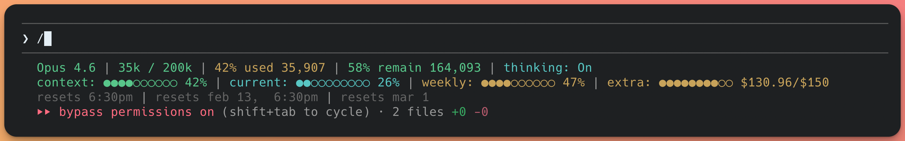

# claude-statusline

A rich multi-line status line for [Claude Code](https://claude.ai/code) with **real rate limit data**.



## What it shows

| Line | Content | Source |
|------|---------|--------|
| 1 | Model name, token counts, used/remaining %, session cost, lines changed | Real data from Claude Code |
| 2 | Context bar, 5-hour usage bar, weekly usage bar, extra credits bar | All real — context from stdin, rate limits from API |
| 3 | Rate limit reset times | Real reset times from API |

## How it works

Claude Code pipes a JSON object to the status line command via stdin on each render tick. The script:

1. Extracts token counts and context data from stdin JSON (single `jq` call)
2. Fetches rate limit data from `https://api.anthropic.com/api/oauth/usage` using your OAuth credentials
3. Caches API responses for 60 seconds with non-blocking background refresh (~590ms API call never blocks the render path)
4. Formats everything with ANSI colors and dynamic color-coding (green/yellow/red based on usage level)

On first run, rate limit bars show `---` for ~1 second until the background API fetch completes.

## Requirements

- [jq](https://jqlang.github.io/jq/) — `brew install jq` (macOS) or `apt install jq` (Linux)
- [curl](https://curl.se/) — pre-installed on macOS and most Linux
- [Claude Code](https://claude.ai/code) CLI (Pro, Max, or Team subscription for rate limit data)

> **Note:** API users (pay-per-token) won't see rate limit bars since they have no usage caps. The context bar and session stats still work.

## Install

```bash
npx claude-statusline
```

Or clone and run locally:

```bash
git clone https://github.com/aromanarguello/claude-statusline.git
cd claude-statusline
./install.sh
```

The wizard asks what data to show, how to format it, previews the result, then writes the script and patches `~/.claude/settings.json` (only the `statusLine` key — all other settings preserved).

## What you can configure

| Field | Description | Requires |
|-------|-------------|---------|
| Model name | Active Claude model | — |
| Token counts | Used / total context size | — |
| Used % | % of context used | — |
| Remaining % | % of context remaining | — |
| Lines changed | +added / -removed in session | — |
| Context bar | ●●●○○○○○○○ visual progress bar | — |
| Rate limit bars | 5-hour & weekly usage bars | Pro/Max/Team |
| Reset times | When rate limits reset | Pro/Max/Team |

**Enterprise/API users:** Rate limit fields are automatically hidden — the wizard detects your account type silently.

## Reconfigure

```bash
npx claude-statusline
```

Re-running the wizard overwrites `~/.claude/statusline-command.sh` with your new choices.

## Uninstall

```bash
cd claude-statusline && ./uninstall.sh
```

## License

MIT
