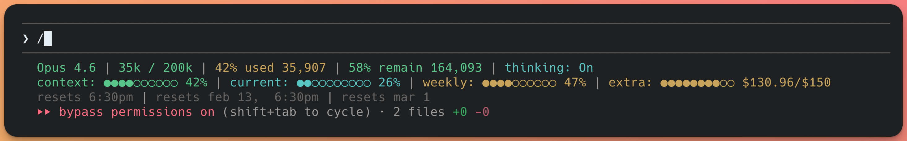

# claude-statusline

[](https://www.npmjs.com/package/@alejandroroman/cc-statusline)
[](https://www.npmjs.com/package/@alejandroroman/cc-statusline)
[](https://opensource.org/licenses/MIT)

A rich multi-line status line for [Claude Code](https://code.claude.com/docs/en/statusline) using Claude Code's native status line data.



## What it shows

| Line | Content | Source |
|------|---------|--------|
| 1 | Model name, token counts, used/remaining %, lines changed | Real data from Claude Code |
| 2 | Context bar, 5-hour usage bar, weekly usage bar | Real data from Claude Code status line JSON |
| 3 | Rate limit reset times | Real reset times from Claude Code status line JSON |

## How it works

Claude Code pipes a JSON object to the status line command via stdin on each render tick. The script:

1. Extracts token counts and context data from stdin JSON (single `jq` call)
2. Reads `rate_limits.five_hour` and `rate_limits.seven_day` when Claude Code provides them
3. Formats everything with ANSI colors and dynamic color-coding (green/yellow/red based on usage level)

Rate limit bars show `---` before Claude Code has emitted rate limit fields, or for plans/accounts where those fields are not available.

## Requirements

- Node.js 18+ (for the installer wizard)
- [jq](https://jqlang.github.io/jq/) — `brew install jq` (macOS) or `apt install jq` (Linux)
- [Claude Code](https://code.claude.com/) CLI

> **Note:** Claude Code exposes context and rate limit fields through the official `statusLine` stdin JSON. Context fields are available after the first API response. Rate limit fields appear for Claude.ai subscribers when Claude Code provides them; API/pay-per-token users may see `---` for those bars.

## Install

```bash
npx @alejandroroman/cc-statusline
```

Or clone and run locally:

```bash
git clone https://github.com/aromanarguello/claude-statusline.git
cd claude-statusline
./install.sh
```

The wizard asks what data to show, how to format it, previews the result, then writes the script and patches `~/.claude/settings.json` (only the `statusLine` key — all other settings preserved).

## Using the wizard

Running `npx @alejandroroman/cc-statusline` (or `node setup.js` if cloned locally) walks you through 4 steps:

**Step 1 — Pick your fields** (multi-select, space to toggle)
```
◆ Which data fields do you want?
◇ ◼ Model name
◇ ◼ Token counts (used / total)
◇ ◼ Used % with raw token count
◇ ◼ Remaining % with raw token count
◇ ◼ Lines changed (+added / -removed)
◇ ◼ Context window progress bar
◇ ◼ 5-hour & weekly rate limit bars
◇ ◼ Rate limit reset times
```

**Step 2 — Pick a layout**
```
◆ Layout?
● Multi-line  (model/tokens on line 1, bars on line 2)
○ Single line (everything on one line)
```

**Step 3 — Pick colors**
```
◆ Color style?
● Traffic-light  (green <50%, yellow 50-79%, red >=80%)
○ Monochrome  (no colors)
○ Custom thresholds
```

**Step 4 — Preview + confirm**

The wizard renders your statusline with sample data so you see exactly what it looks like before writing anything:
```
Claude Sonnet 4.6 (1M context) | 48k / 1000k | 5% used 48,200 | 95% remain 951,800
context: ○○○○○○○○○○ 5% | 5-hour: ●●○○○○○○○○ 23% | weekly: ●●●●○○○○○○ 41%
5-hour resets 11:00am feb 01 | weekly resets 11:00am feb 06
```

Then confirms before touching any files:
```
◆ Write to ~/.claude/statusline-command.sh and patch settings.json? Yes
```

After confirming, **restart Claude Code** to see your new status line.

## What you can configure

| Field | Description | Requires |
|-------|-------------|---------|
| Model name | Active Claude model | — |
| Token counts | Used / total context size | — |
| Used % | % of context used | — |
| Remaining % | % of context remaining | — |
| Lines changed | +added / -removed in session | — |
| Context bar | ●●●○○○○○○○ visual progress bar | — |
| Rate limit bars | 5-hour & weekly usage bars | Claude Code `rate_limits` fields |
| Reset times | When rate limits reset | Claude Code `rate_limits` fields |

**Enterprise/API users:** Rate limit fields degrade gracefully to `---` when Claude Code does not provide usage caps. The context bar and session stats still work.

## Reconfigure

```bash
npx @alejandroroman/cc-statusline
```

Re-running the wizard overwrites `~/.claude/statusline-command.sh` with your new choices.

## Uninstall

```bash
cd claude-statusline && ./uninstall.sh
```

## License

MIT
